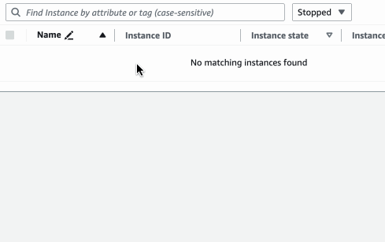
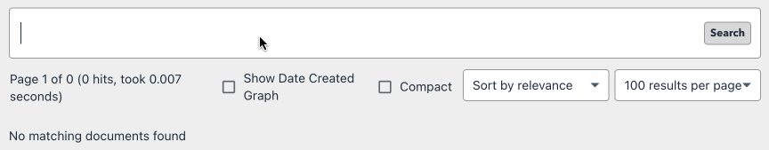
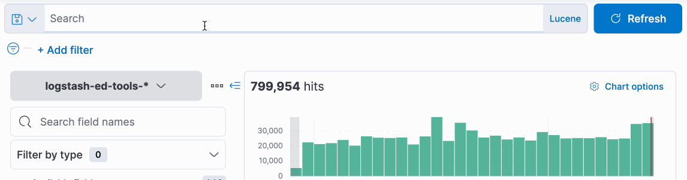

There's a UI pattern for search that I've seen implemented in a few places. In line with the convention at the Guardian, I'm going to call that pattern 'chips' – a way of adding field-specific search terms to search queries as you type, with typeahead to aid discoverability.

This sounds like a lovely thing to have at an organisation that catalogues tens of thousands of images and publishes around 300 pieces a day – in short, an organisation awash with content of every sort to discover.

But! Every implementation of a chip-based (or chip-ish) search interface that I am aware of, either at the Guardian, or elsewhere, falls a bit short. By looking at a few examples, let's build up a feature list for the sort of thing we'd _like_ to have.

## All that and a bag of chips

Here are chips in the Guardian (and now the BBC's) open source image management tool, [**the Grid**](https://github.com/guardian/grid):

This is a neat feature. The tool's comprehensive search indicies are discoverable from the keyboard, as you're writing the search query. There a few drawbacks to the Grid's implementation, though. Chips can only be added at the front of the search. They're added _from_ the text input, but they're not a part of its value, and so you cannot navigate back to them with the caret to edit or remove them.

A similar pattern is used in **AWS EC2 instance search** (and elsewhere in the AWS dashboard), and although you cannot navigate between chips with the caret, it _is_ possible to navigate to them with the keyboard via the tab key, making keyboard-only input possible.

In [**Giant**](https://github.com/guardian/giant), the Guardian's open-source document ingestion and search platform, there's a more current implementation. Alongside correct caret behaviour (but not selection behaviour – each chip is its own input, and selection cannot cut across chips or search terms), the chips are inline with the query, an affordance which implies that their order might be important.

In fact, order _is_ an important feature! Giant supports boolean operators and groups (e.g. `this AND (that OR those)`) for both general search terms and chip fields. But! There's nothing to signify that this is possible, or that it's working when you have used it, something syntax highlighting might make clearer.

It's worth comparing these UIs to the query languages in tools like [**Kibana**](https://www.elastic.co/kibana) (which is powered by Lucene, or another query language similar to Lucene, KQL, which has a few features that are useful for Elasticsearch.) Here's Kibana's Discover mode in action:

Interestingly (ironically?), discoverability in this input is limited: I cannot discover an index (Elasticsearch would call it a field) without beginning to type, and so browsing indices is impossible. I also cannot discover a subset of values for an index once I have specified it – where, for example, typing `stage:` might offer `CODE|PROD|TEST`. This is possible in the menu on the right hand side here, but it'd be nice to do it within the input itself for the purposes of our specification.

A text query language offers the ultimate in editability, though – as a single document, editing and copy-and-pasting values just works.

But there's no syntax highlighting, and if you get something wrong, the failure mode is a binary 'search failed', repeated across the `n` shards you were searching – despite there being a query grammar! What a shame.

Finally, **Github's** search comes the closest to ticking all the boxes we've added, with more comprehensive autocomplete – although its syntax precludes discovering all available search terms. And it has syntax highlighting! Nice:

## When the chips are down

So chips are out there – and they're a bit janky, or they're not as expressive or fully-featured as we'd like them to be. But we've got a decent feature list for what chips _could_ be, right there:

|Feature|Grid|AWS EC2 search|Giant|Kibana Discover|Github|
|-|-|-|-|-|-|
|🔍 Discoverability|✅|✅|✅|❌|⚖️|
|⌨️ Keyboard-only input|❌|✅|✅|✅|✅|
|📄 Query as single document|❌|❌|⚖️|✅|✅|
|💻 Boolean operators and groups|❌|❌|✅|✅|✅|
|🧳 Portability (copy and paste)|❌|❌|❌|✅|✅|
|✨ Syntax highlighting|❌|❌|❌|❌|✅|
|🚨 Error reporting|❌|❌|❌|❌|❌|

How hard can it be to make a tool that gives us all of the above? We'll need three things:
1. A query language that lets us express key value pairs, boolean operators, grouping, etc., with discoverability at the forefront
2. A parser for that language, to provide underlying support for syntax highlighting and error reporting, and to open the door for consumers to interpret the language into their own query DSLs
3. A UI that can use the output of the parser to power the features we list above!

The query language comes first, and so we'll tackle that in the next post.