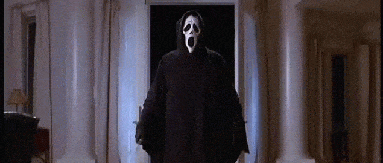
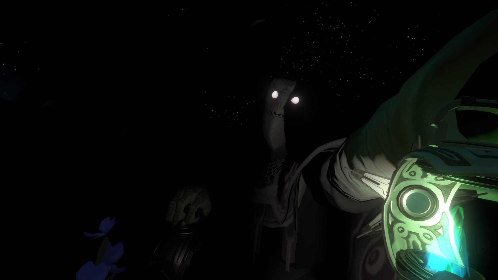

It feels sort of obvious – the more fear we experience, the worse we are at problem solving.

I've carried this intuition around for a while, and if pressed, I think I would have claimed that this effect scaled with whatever stakes were involved in failure or success. People are frightened by increasingly terrifying scenarios: they do correspondingly sillier things.

But then I experienced the effect powerfully, a few days ago, in an environment with no real-life stakes at all.

[_The Outer Wilds_](https://www.mobiusdigitalgames.com/outer-wilds.html) is a videogame, and it's an ideal place for a demonstration of the fear-is-the-mindkiller effect because it is, quite literally, a small solar system of problems to solve. In a craft that's part NASA, part National Park chic, the player veers from planet to planet in a groundhog-day timeloop, piecing together its secrets before the sun goes supernova. Then, they do it all again, armed only with the knowledge of what came before. It's superb.

Anyhow, _The Outer Wilds_ came out in 2019, and three days ago I made some time to play its recently released expansion, Echoes of the Eye. I raced through problem after problem, building up my understanding of a new world and its inhabitants. And then, the lights went out, there was a creaking, I saw a silhouette against a distant light, and ...

Oh no. Oh _no_.

### The scary owl folk made me dumb

See, two thirds of the way through the game, the tone changes a bit. Things are darker: physically, and in the other sense. Before, I could explore freely, my only opponent the consistent (if consistently punishing) mechanics of a cold unfeeling universe. Now, there were things in the dark. Searching. Pursuing. Snuffing me out.

I got stuck. _Really_ stuck. And I wasn't the only one. Lots of [other people](https://www.reddit.com/r/outerwilds/comments/pz1zqs/does_anyone_else_feel_like_echoes_of_the_eye_is/) got stuck. Some of the game's [reviewers](https://www.rockpapershotgun.com/echoes-of-the-eye-is-sensational-dlc-for-outer-wilds-dont-let-anyone-spoil-it-for-you) got stuck.

But I don't think the game got harder at that point. It just got – scarier. The questions the game asks of you are so much harder to answer when your mind, previously unfettered and leaping nimbly from stepping stone to logical stepping stone, is instead cowering at the thought of being apex-predatored.

I knew that fear was the mind-killer in principle, but I don't think I've experienced it so clearly in practice. It took some deep, steadying breaths, a fair few retries, and some shameful search-engining, before I cracked the last puzzle and the universe was set right once again.[^1]

Fear is rubbish. It stops us from thinking clearly. Peter Matthiessian gives us a glimpse of the ancient foundations of this truth in _The Snow Leopard:_

> 'It is this clinging, the tightness of panic, that gets people killed: "to clutch", in ancient Egyptian, "to clutch the mountain", in Assyrian, were euphemisms that signified "to die".'[^2]

And, importantly, it doesn't matter whether the mountain you are clutching is virtual, or corporeal. The consequences are real regardless. I've seen fear force promising young developers out of entry-level positions, and watched it prevent entire companies from making the changes necessary to adapt and survive. You, gentle reader, will no doubt have your own examples.

### Don't be afraid ... of using these powerful fear-management techniques

In life as in the Outer Wilds, there are things we can do to manage our fear.

In a software engineering context, having a [no-blame culture](https://devops.com/how-sre-creates-a-blameless-culture/) lowers the stakes for individuals when things go wrong, and helps organisations to better learn from failure. Having a clear understanding of the ways a project might fail, for example by running a [project premortem](https://www.atlassian.com/team-playbook/plays/pre-mortem), can lead to a better understanding of risks and how they might be mitigated. And sharing knowledge with techniques like [pair programming](https://martinfowler.com/articles/on-pair-programming.html) and [code review](https://www.atlassian.com/agile/software-development/code-reviews) can spread responsibility and ownership, which can improve architectural outcomes, reduce the likelihood of failure, and make incidents less scary when they occur.

There are lots of strategies we can use to reduce our fear factor – many more than would be worth listing here – but the important thing is to recognise fear where it exists, understand its negative impact on our ability to think clearly, and take steps to manage it.

At the end of _The Outer Wilds_, we discover a beautiful piece of thematic symmetry – the mysterious strangers we have been cowering from were scared once, too. And their fear caused them to make a catastrophic error of judgement, a mistake that doomed their kind forever.

Hey! Let's not be doomed. It's reasonable for individuals and teams to feel a few tremors when the stakes are high, or the outcome is unknown. But we can recognise this fear, and cultivate strategies to manage it. Because it's only without fear that we're best placed to solve our problems.

[^1]: Well, not _that_ universe. ... I've said too much.

[^2]: Peter Matthiessen, _The Snow Leopard_ (1987), p125.
