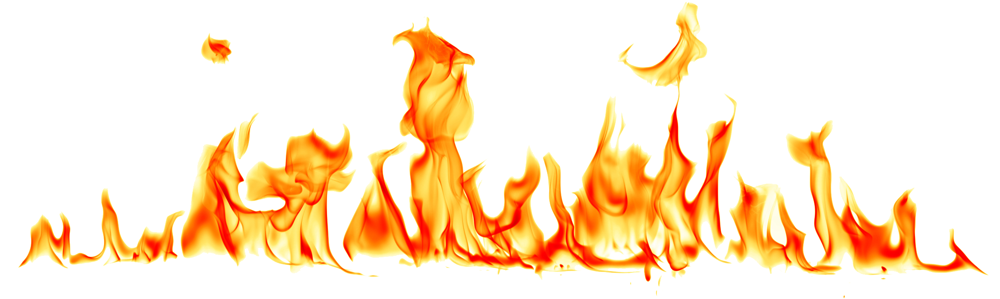
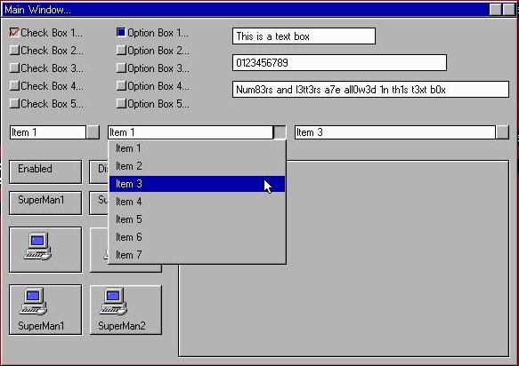
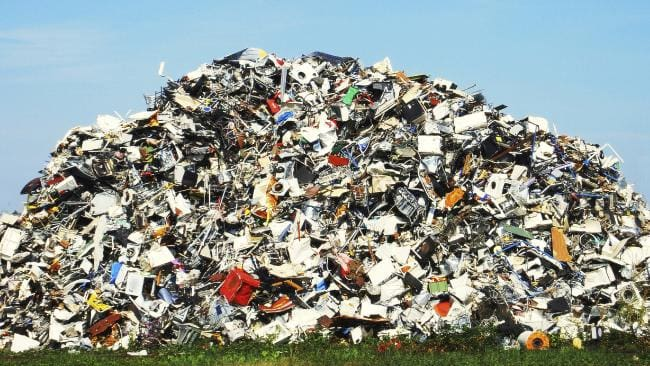
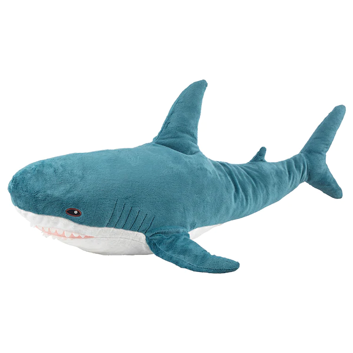

_This is part one of a series adapted from a talk me and Reetta gave internally at the Guardian, and then later at Continuous Lifecycle. Thanks, Reetta, for your help with the talk!_

This is a story about a time in my career when I thought the software I was working with was, well -- a bit rubbish.

As the title and the opening sentence imply, that initial assessment turned out to be not quite right. And we can use this example to consider another way of thinking about software in general.

Unlike a lot of stories about programming, this one begins in a crematorium.

I was working for a lovely startup at the time, and we'd just picked up a new client. This client supplied media software to academic settings, places that did weddings, and places that did funerals. We were hired to rewrite that software. At the beginning of the project, we actually got a backstage tour. In order to impress upon us the seriousness of the project we were about to embark upon, our client took us on-site, and we went both figuratively and literally behind the veil of an _actual crematorium_.

That’s another story, perhaps best told elsewhere, but this is where we first got to see their current setup at work. I can’t show you exactly what it looked like, but it looked a lot like this.

## Walking in a windows wonderland

Well, it looked old and fusty, granted. And as we dug deeper, it got fustier. The whole system was built like somebody had taken a who’s who of every condescending comment about software design they'd ever heard on the internet, and used each one of those comments as reverse-advice out of spite.

It was written in Visual Basic 6. It communicated with an API built out of emails with parsers that only understood ASCII. The cloud services used autogenerated code, producing queries that on occasion totalled 72 joins nested in prepared statements. There was no version control, only a list of folders. The folders were named by somebody that had perhaps heard of semantic versioning, and dipped a toe in, but then decided that they wanted no part of it. If any software looked a bit rubbish -- this was it.

But we weren't completely naive -- we knew there was real complexity here. We did a decent job reverse engineering the interfaces, modelling the system, and building something new. That went OK. Then, we made a mistake.
 
The client hated the old interface. This was 2015! And they had this Windows 98-looking thing. They wanted us to come up with something new, something exciting. They knew their users weren’t very tech literate, but they were confident that, their old system being such a relic, it wouldn’t be too hard to figure something out.

We made our plans. There would be two themes -- a legacy theme that would recreate the old interface in all its orthogonal glory as a drop-in replacement, and a new theme, that would take the legacy theme and spin its rough, 90’s era edges into contemporary gold.

We delivered the old theme first. It did exactly what it said on the tin. Then we worked on a design for the new theme. We iterated a few times. Our first design, the client said, was too close to the old theme. No good! They wanted something more unique, more … creative. We had a few more tries, and eventually, the project managers on the client side were happy -- it looked great. We built it.

It was _terrible_.

## The old users and the (deep blue) sea

It wasn't hard to see why. The users hated it. _We_ hated it. By trying to please both low and high tech literacy users at the same time, it got in the way of both groups. It was difficult to see what was going on at a glance. It took too long to get around. The view that had previously been most privileged -- which included track search and playlist assembly -- was buried beneath layers of navigation.

We found ourselves testing and debugging the system in 90’s mode. It was a better time. If we’d looked beyond the Windows 98 facade, we would have understood that although the old interface looked crumby, it had spent almost 15 years being field tested in a high-stakes environment with some of the least tech literate users it’s possible to have in a workplace. It had been honed by software evolution. It was like … a shark.

The client were happy with the old theme, and we’d run out of time, so we parked the new one. As far as I know, it’s still gathering dust, and people using that software are still getting their playlists from a system that was built in 2017 but looks like it shipped almost two decades earlier.  

By dismissing the software we were working with as outmoded and clunky -- as rubbish -- we missed what it was doing well. And as a result, we underestimated the complexity of the problem we were trying to solve.

## 'Rubbish' considered harmful

We can think of that moment of dismissal without understanding as a red flag. Every utterance that registers on the spectrum of rubbishness -- from casual, aloof dismissal to righteous, four-letter-word rage -- should be a prompt for us to ask more questions. We might learn that the problem under discussion was more complex than we originally thought. We might learn that it's a different problem than the one we thought it was. We might learn that in the context in which the problem was first encountered, the solution was actually remarkably elegant. And we can extend this insight outwards to the frameworks we use, the languages we work in, and even the peers we work with.

It’s difficult to arrive at these insights if we've chucked things in the mental wastebasket. So next time you notice somebody do it, it might be worth wrinkling your nose and fishing out what they've tossed in, to take a closer look.

