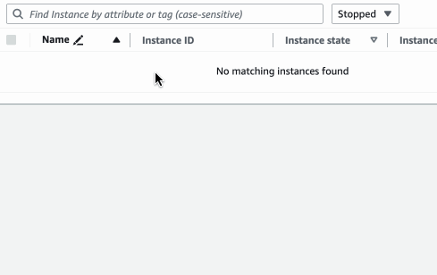
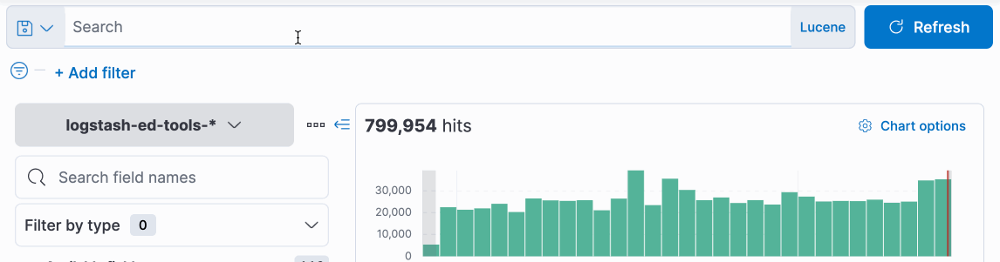
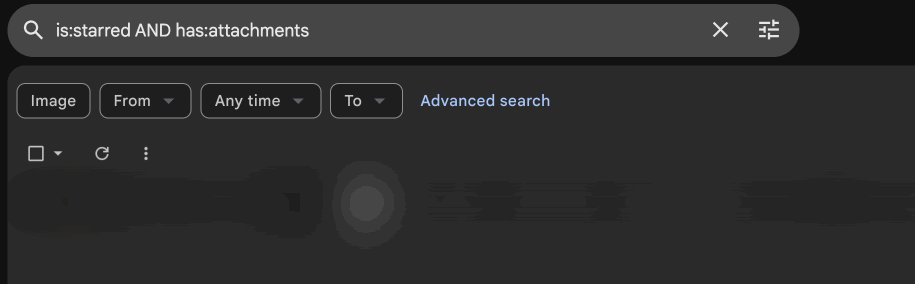

There's a UI pattern for search that I've seen implemented in a few places. In line with the convention at the Guardian, I'm going to call that pattern 'chips' — a way of adding field-specific search terms to search queries as you type, with typeahead to aid discoverability.

This sounds like a lovely thing to have at an organisation that catalogues tens of thousands of images and publishes around three hundred pieces a day — in short, an organisation awash with content of every sort to discover.

But! Every implementation of a chip-based (or chip-ish) search interface that I am aware of, either at the Guardian, or elsewhere, falls a bit short. By looking at a few examples, let's build up a feature list for the sort of thing we'd _like_ to have.

Before we begin: lots of credit here to [paperboyo](https://github.com/paperboyo), a product manager at the Guardian whose chip-related thoughts inspire a lot of the below 🍟

## All that and a bag of chips [^1]

Here are chips in the Guardian (and now the BBC's) open source image management tool, [**the Grid**](https://github.com/guardian/grid):

This is a neat feature. The tool's comprehensive search indicies are discoverable from the keyboard, as you're writing the search query. There a few drawbacks to the Grid's implementation, though. Chips can only be added at the front of the search. They're added _from_ the text input, but they're not a part of its value, and so you cannot navigate back to them with the caret to edit or remove them. Because of this, the way the caret moves between chips and the search input is unpredictable, and sometimes buggy.

A similar pattern is used in **AWS EC2 instance search** (and elsewhere in the AWS dashboard), and although you cannot navigate between chips with the caret, it _is_ possible to navigate to them with the keyboard via the tab key, making keyboard-only input possible.

[**Giant**](https://github.com/guardian/giant), the Guardian's open-source document ingestion and search platform, goes further. Alongside correct caret behaviour (but not selection behaviour — each chip is its own input, and selection cannot cut across chips or search terms), the chips are inline with the query, an affordance which implies that their order might be important.

In fact, order _is_ an important feature! Giant supports boolean operators and groups (e.g. `this AND (that OR those)`) for both general search terms and chip fields. But there's nothing to signify that this is possible, or that it's working when you have used it, something syntax highlighting might make clearer.

It's worth comparing these UIs to the query languages in tools like [**Kibana**](https://www.elastic.co/kibana) (which is powered by Lucene, or another query language similar to Lucene, KQL, which has a few features that are useful for Elasticsearch.) Here's Kibana's Discover mode in action:

A text query language offers the ultimate in editability. As a single document, editing and copy-and-pasting values just works.

Interestingly (ironically?), discoverability in this input is limited: I cannot discover an index (Elasticsearch would call it a field) without beginning to type, and so browsing indices via the query prompt is impossible. I also cannot discover a subset of values for an index once I have specified it — where, for example, typing `stage:` might offer `CODE|PROD|TEST`. This is possible in the menu on the right hand side on the Discover page, but it'd be nice to do it within the input itself for the purposes of our specification.

But there's no syntax highlighting, and if you get something wrong, the failure mode is a binary 'search failed', repeated across the `n` shards you were searching — despite there being a query grammar! A missed opportunity.

**Github's** search comes the closest to ticking all the boxes we've alluded to above, with more comprehensive autocomplete — although its syntax precludes browsing search terms, as in Kibana. It even has syntax highlighting! Nice:

Error reporting is also present, but you must hit search to discover that you've made a mistake:

Finally, loathe as I am to [call anything rubbish](./its-not-rubbish), a (dis)honourable mention to Gmail's search input, which offers a similarly powerful query language, and then hides its affordances behind some odd UI choices. Boolean operators and field-specific search are both present, with keys and values separated by `:`, but the user must … [google, I guess?](https://support.google.com/mail/answer/7190?hl=en&co=GENIE.Platform%3DAndroid) to discover what's possible – I can't see a link to the documentation anywhere in the UI.

Note also the additional filter UI. What if those filters added to the query, revealing both the fields available and their syntax? This feels like it misses a point of discovery for users new to the syntax — but there may be good reasons to use two modes of input here, and I'd be interested to see what Google's telemetry reveals about usage patterns. We'll return to those thoughts later in this series, when we're implementing our UI.

## When the chips are down

So chips are out there — and they're a bit janky, or they're not as expressive or fully-featured as we'd like them to be. But we've got a decent feature list for what chips _could_ be, right there:

|Feature|Grid|EC2|Giant|Kibana|Github|Gmail|
|-|-|-|-|-|-|-|
|🔍 Discoverability|✅|✅|✅|❌|⚖️|❌|
|⌨️ Keyboard-only input|❌|✅|✅|✅|✅|✅|
|📄 Query as single document|❌|❌|⚖️|✅|✅|❌|
|💻 Boolean operators and groups|❌|❌|✅|✅|✅|✅|
|🧳 Portability (copy and paste)|❌|❌|❌|✅|✅|❌|
|✨ Syntax highlighting|❌|❌|❌|❌|✅|❌|
|🚨 Real-time error reporting|❌|❌|❌|❌|❌|❌|

How hard can it be to make a UI component that gives us all of the above? There's only one way to find out! We'll need three things:
1. A query language that lets us express key value pairs, boolean operators, grouping, etc., with discoverability in mind.
2. A parser for that language, to provide underlying support for syntax highlighting and error reporting, and to open the door for consumers to interpret the language into their own query DSLs.
3. A UI that can use the output of the parser to power the features we list above!

The query language comes first, and so we'll tackle that in the [next post.](/structured-search-ui-2)

[^1]: This will probably get worse.