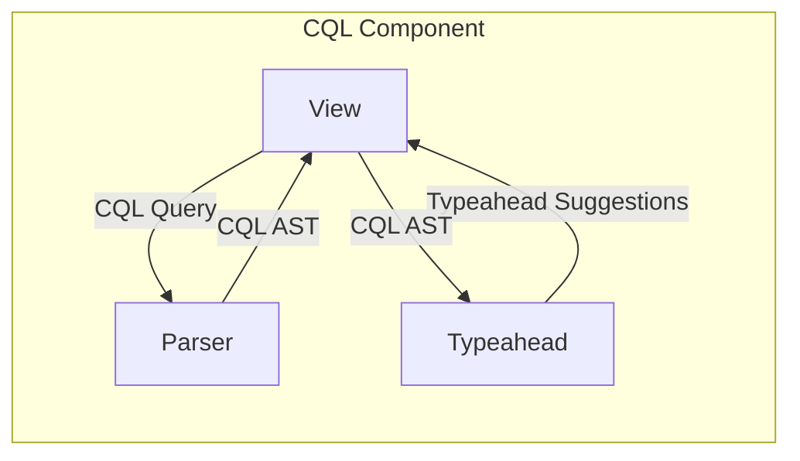
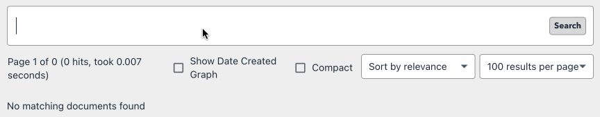
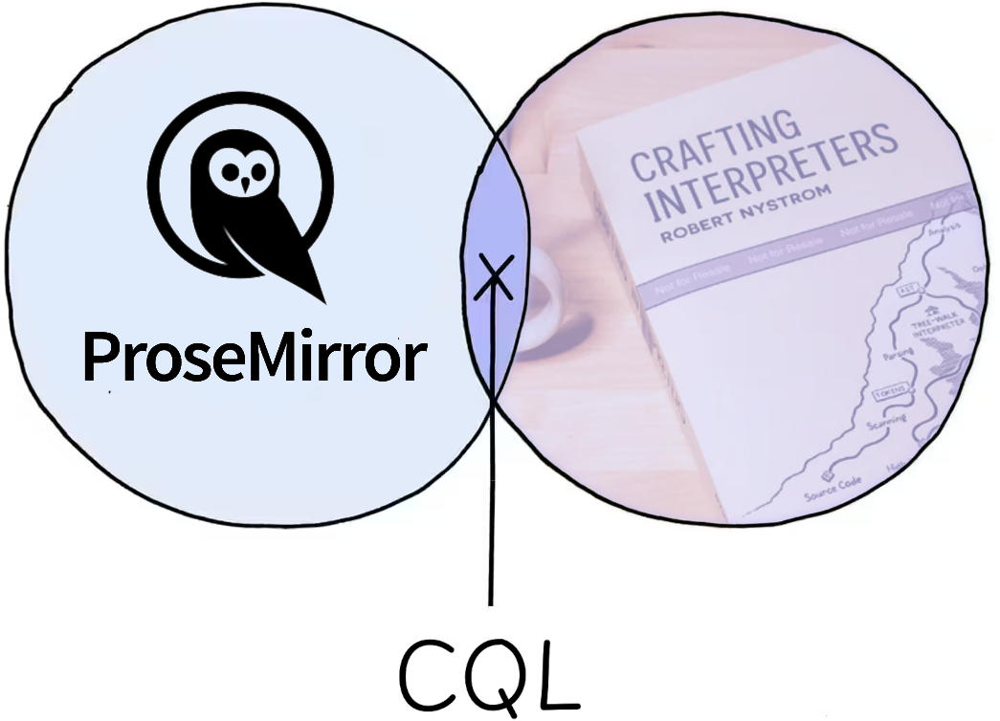
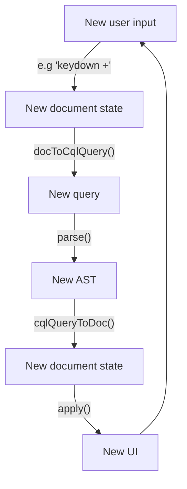

With our parser for CQL complete in [part 4](/structured-search-ui-4), it's time to implement our UI. In [part 1](/structured-search-ui-1), we had an ambitious list of features for our search component:

- 🔍 Discoverability
- ⌨️ Keyboard-only input
- 📄 Query as single document
- 💻 Binary operators and groups
- 🧳 Portability (copy and paste)
- ✨ Syntax highlighting
- 🚨 Real-time error reporting

In this post, we'll hook up our tokeniser and parser with a UI component powerful enough to express all of them. We'll hand-wave a few things — typeahead and popover behaviour are fairly easy to solve — in favour of covering the challenges that were specific to representing our query language in a structured, editable UI.

When I set out to build the view, I wanted something that wasn't tied to particular product. Although our search grammar seems quite specific, we can imagine serving a subset, or superset, of its features for different use cases. For example:
- The Guardian's digital asset management system, The Grid, supports key-value pairs, but no boolean operators or groups.
- The Guardian's Content API supports all of those things in most cases, but does not permit key-value pairs within groups.
- Kibana supports all of those things, and more, via KQL or Lucene.

So it feels like it should be possible to configure our parser to enable or disable features, or to swap it for another parser that supports more features, or another query language altogether. Each product will also have different requirements for its typeahead, too — some keys and values may be known ahead of time, some will need to be discovered asynchronously as a product of their context, and ways that all of this will happen is likely to differ from product to product.

In short, the component view, parser and typeahead are best kept loosely coupled with clear interfaces, and composed together into a component, like so:



There are aspects of the view that are tricky. We'd like syntax highlighting, and I'd also like to explore adding a visual representation of our chips that makes their role in queries clearer, a bit like the UX for Giant we've briefly seen in part 1. You can see below that key-value pairs have their own visual treatment, as well as a way to remove them with a click:



There are many ways we can implement this. Giant does it by rendering each query element — search text, chip key, chip vaue — as its own input. The search component then manages cursor movement manually as users move the caret across those elements with the keyboard. This works well for collapsed selections, where there's only a caret to represent, but it's much trickier to represent selections that cut across multiple fields, or the entire document: the `📄 Query as single document` feature above.

Another way would be to treat the entire query as a single, `contenteditable` interface. Unfortuately, `contenteditable` is [widely acknowledged](https://www.youtube.com/watch?v=EEF2DlOUkag) to be [awful](https://medium.engineering/why-contenteditable-is-terrible-122d8a40e480#.mqvm5uq1o). But! This is where I can activate a trap card. For some number of years now, I've worked on-and-off on the Guardian's rich text editor, Composer, which has been using the open-source text editor library ProseMirror since 2018. ProseMirror does a good enough job of abstracting the gnarly parts of contenteditable behind a clean, stable interface that some non-trivial subset of the publishing world use it for their tooling, too.[^1] Which makes implementing the CQL project a neat intersection of two fun things:



With this in mind, let's write some code. We'll express our UI as a web component, for portability, with a simple interface like:

```jsx
// In HTML
<cql-input id="example-input"></cql-input>

// In JavaScript
const input = document.getElementById("example-input")
input.addEventListener("queryChange", (queryStr) => {
    // Do something with the new query :)
})
```

The scaffolding for a web component looks a bit like:

```typescript
export type CqlResult = {
  tokens: Token[];
} & {
  queryAst: CqlQuery;
} | {
  error: Error;
}

export const createCqlInput = (
    parseCqlQuery: (cqlQuery: string) => CqlResult
) => {
  class CqlInput extends HTMLElement {
    public value = "";
    private styleTemplate = document.createElement("template");
    private editorView: EditorView | undefined;

    connectedCallback() {
      // Set up shadow DOM and styling
      const shadow = this.attachShadow({ mode: "open" });
      template.innerHTML = `<style>/* styling will go here */</style>`;
      shadow.appendChild(template.content.cloneNode(true));

      // Attach input element to shadow DOM
      const cqlInputId = "cql-input";
      const cqlInput = shadow.getElementById(cqlInputId)!;
      shadow.innerHTML = `<div id="${cqlInputId}" spellcheck="false"></div>`;

      // Add a change handler
      const onChange = (detail: QueryChangeEventDetail) => {
        this.value = detail.cqlQuery;
        this.dispatchEvent(
          new CustomEvent("queryChange", {
            detail,
          })
        );
      };

      // Create our ProseMirror view, bound to the input element, and pass
      // a change handler to call when the document state changes
      const editorView = createEditorView({
        mountEl: cqlInput,
        onChange
      });
    }

    disconnectedCallback() {
      this.editorView?.destroy();
    }
  }

  return CqlInput;
};
```

We're assuming the existence of a function that, given a CQL query, returns a list of tokens, and either a CQL AST, or an error. This makes our CQL component pluggable — the user can bring their own parser implementation. There's some boilerplate to set up the component DOM and styling, and then we call `createEditorView`, which will create an instance of a ProseMirror editor. Here's what that looks like:

```typescript
import { EditorView } from "prosemirror-view";
import { EditorState } from "prosemirror-state";
import { baseKeymap } from "prosemirror-commands";
import { undo, redo, history } from "prosemirror-history";
import { keymap } from "prosemirror-keymap";
import { doc } from "./schema";

export const createEditorView = ({
  mountEl,
}: {
  mountEl: HTMLElement;
}) => {
  const plugin = createPlugin()

  const view = new EditorView(mountEl, {
    state: EditorState.create({
      doc: doc.create(),
      schema: schema,
      plugins: [
        keymap({
          ...baseKeymap,
          "Mod-z": undo,
          "Mod-y": redo,
        }),
        history(),
      ],
    }),
  });

  return view;
};
```

This will create a standard ProseMirror editor with some basic functionality: platform-specific keybindings for [common actions](https://prosemirror.net/docs/ref/#commands.baseKeymap), and document history for undo/redo with the [`prosemirror-history` plugin.](https://prosemirror.net/docs/ref/#history) But hang on — what's `schema`?

A ProseMirror editor requires a schema to enforce its document structure. A document structure is a tree, just like the content of a `contenteditable` node, but unlike `contenteditable`, a ProseMirror schema establishes what nodes can exist in its document, and how they can be combined. We'll dig into schemas in more detail later in this post, but for now, our needs are very basic. Let's start with a simple document that can only contain a single sort of node, `queryText`, which in turn will simply contain plain text:

```typescript
const schema = new Schema({
  nodes: {
    doc: {
      content: "queryText",
    },
    queryText: {
      content: "text*",
      // Express our queryText nodes as `<query-text>{content}</query-text>`
      // when they're rendered in the DOM
      toDOM: () => ["search-text", 0],
      // Preserve all whitespace
      whitespace: "pre",
    },
    text: {}
  },
});
```

A schema defines its content in a similar way to our grammar in [part 2](/structured-search-ui-2). In our grammar, on each line we declared a symbol, and a rule that defined the valid sequence(s) of terminal or nonterminals for that symbol. In our ProseMirror schema, for each node declaration, we'll define a node name (the key within the `nodes` object), and within the `content` property of that node's definition, we'll define what's permitted in the node. For now, our document can contain just one `queryText` node, which in turn can contain any number of `text` nodes.

The ecosystem provides a [basic schema](https://github.com/ProseMirror/prosemirror-schema-basic) to get you started with rich text, but schemas can be large and expressive — the Guardian uses a schema with hundreds of node types to .

[^1]: The NYT, the Financial Times, YT … add your organisation here!

Structure:

Reminder of the feature set we're implementing.

What we'll need:
- parser
- way to wrangle contenteditable
- maybe a little introduction to Prosemirror
- cute Venn diagram of my two skills

Structure

Implement parts of structure, one after t'other

????

Profit


