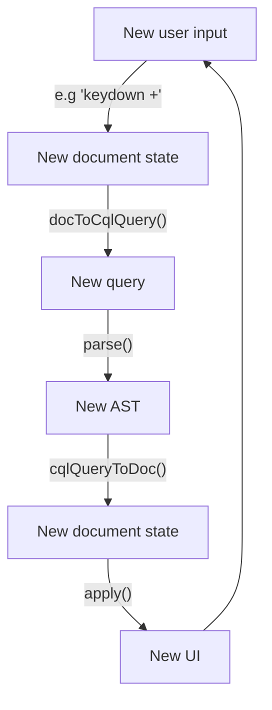

Structure:

Reminder of the feature set we're implementing.

What we'll need:
- parser
- way to wrangle contenteditable
- maybe a little introduction to Prosemirror
- cute Venn diagram of my two skills

Structure

Implement parts of structure, one after t'other

????

Profit

