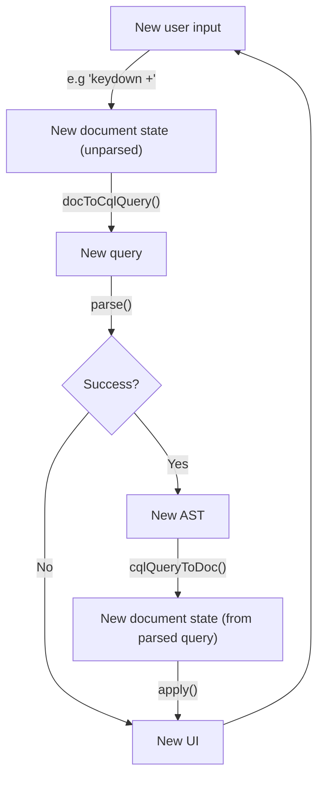
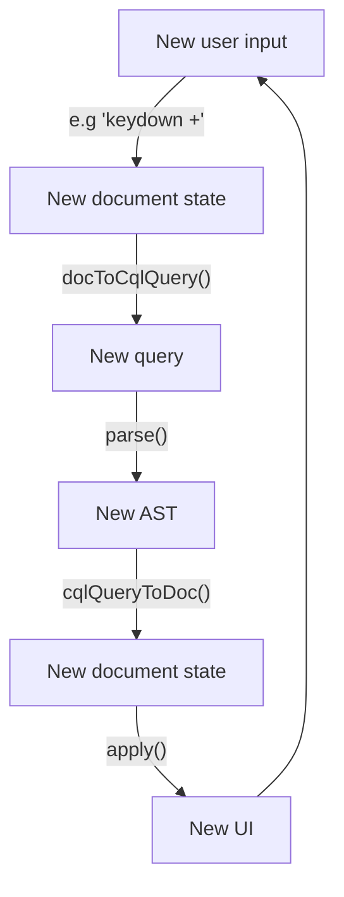

We'll hand-wave a few things — typeahead and popover behaviour are fairly easy to solve — in favour of covering the challenges that were specific to representing our query language in a structured, editable UI.

 Every time we receive new input from the editor, we'll want to parse the new document we receive as a result of the input, and transform that _back_ into a ProseMirror document again, ensuring our input reflects our parsed output. If the parse fails, we can simply accept the input as it stood, keeping the error information to display to the user.

// Full parse workflow

In code, this looks like:

// Code example of pm->cql, cql->pm, plugin code

As our scanner is currently implemented, this has the side-effect of normalising our input when it's valid — extra whitespace at the start or end of queries, for example, is stripped out.

//

// Schema detail

A schema defines its content in a similar way to our grammar in [part 2](/structured-search-ui-2). In our grammar, on each line we declared a symbol, and a rule that defined the valid sequence(s) of terminal or nonterminals for that symbol. In our ProseMirror schema, for each node declaration, we'll define a node name (the key within the `nodes` object), and within the `content` property of that node's definition, we'll define what's permitted in the node. For now, our document can contain any number of `text` nodes — the minimum we need to support plain text input.

The ecosystem provides a [basic schema](https://github.com/ProseMirror/prosemirror-schema-basic) to get you started with rich text, but schemas can be large and expressive — the Guardian uses a schema with hundreds of node types to express the many different kinds of structured content their platform supports.

[^1]: The NYT, the Financial Times, YT … add your organisation here!

Structure:

Reminder of the feature set we're implementing.

What we'll need:
- parser
- way to wrangle contenteditable
- maybe a little introduction to Prosemirror
- cute Venn diagram of my two skills

Structure

Implement parts of structure, one after t'other

????

Profit

